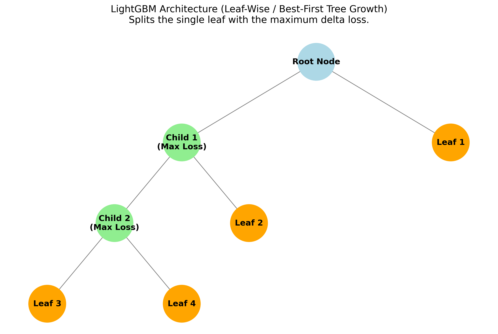
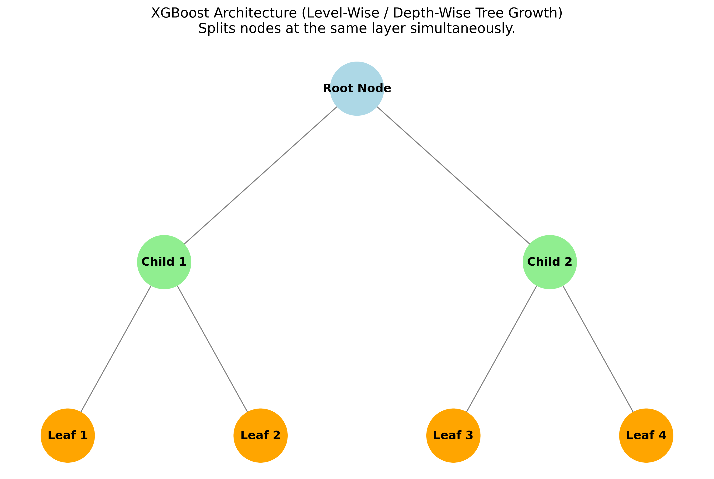
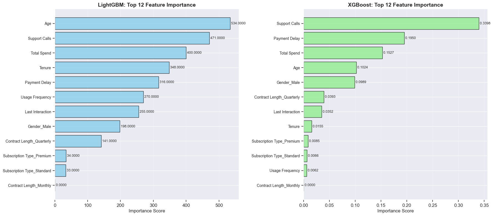
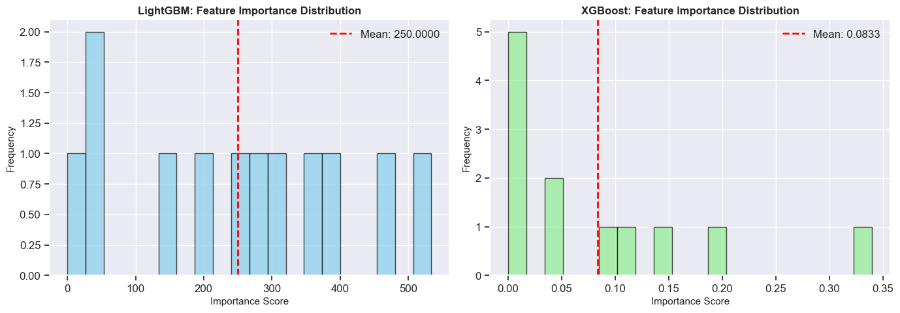
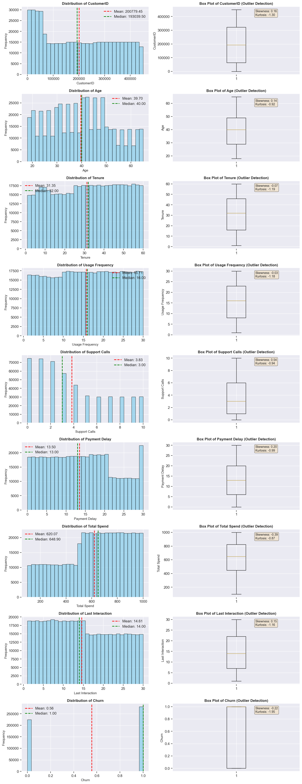

# Customer Churn Prediction: LightGBM vs XGBoost

## 1. Project Overview & Objectives
The primary objective of this project is to build a robust machine learning pipeline to predict customer churn. Specifically, this project implements and evaluates two advanced ensemble learning algorithms—**LightGBM** and **XGBoost**—and compares them against a baseline rule-based logic. The focus is to evaluate these models not only on standard predictive metrics like Accuracy and F1-Score but also on computational efficiency (e.g., Training Time, Inference Speed), culminating in a production-ready model recommendation.

## 2. Dataset Description & Identified Challenges

### Dataset Overview
* **Shape:** 505,207 records across 12 features.
* **Features:** CustomerID, Age, Gender, Tenure, Usage Frequency, Support Calls, Payment Delay, Subscription Type, Contract Length, Total Spend, Last Interaction, Churn.

### Identified Challenges & Data Quality
During the Data Challenges Visualization step, the following key characteristics were discovered:
* ⚠️ **Class Imbalance:** A slight class imbalance exists with an Imbalance Ratio of 1.25:1 (Churn Rate: 55.52%).
* **Missing Values & Outliers:** The initial snapshot interestingly showed 0% missing values across key operational columns and no extreme IQR outliers.
* **Feature Engineering Needs:** While direct challenges like missing data were negligible, features like Gender, Subscription Type, and Contract Length required robust categorical encoding to be machine-learning ready.

## 3. Model Architecture & Approach

### Baseline
* **Rule-Based Model:** Attempted a baseline heuristic (e.g., Age < 35 AND Purchases < 5000 -> Churn) to understand the effectiveness of manual rules versus ML algorithms.

### Advanced Algorithms (LightGBM & XGBoost)
We selected **LightGBM** and **XGBoost** because gradient-boosted decision trees are the state-of-the-art for tabular data.
* **LightGBM:** Utilizes a leaf-wise tree growth algorithm, making it exceptionally fast for training on large datasets while restricting memory usage.

* **XGBoost (with histogram tree method):** Utilizes depth-wise tree growth with a `hist` tree method, providing highly optimized and parallelized exact greedy algorithms for split finding. 

* **Justification:** Both models natively handle non-linear relationships, perform implicitly well without extensive feature scaling, and are rigorously optimized for CPU Cache, making them the most computationally efficient choice for this ~500k row dataset.

## 4. Model Comparison Summary

Both models performed exceptionally well, achieving over 92% accuracy. However, there is a clear trade-off between slight training speed advantages for LightGBM and massive inference speed advantages for XGBoost. 

| Metric | LightGBM | XGBoost | Advantage |
|--------|----------|---------|-----------|
| **Accuracy** | 0.9249 | 0.9237 | LightGBM (+0.12%) |
| **Precision** | 0.8993 | 0.8988 | LightGBM (+0.05%) |
| **Recall** | 0.9737 | 0.9720 | LightGBM (+0.17%) |
| **F1-Score** | 0.9350 | 0.9340 | LightGBM (+0.10%) |
| **ROC-AUC** | 0.9484 | 0.9483 | LightGBM (+0.01%) |
| **Training Time (s)** | 6.67 | 7.04 | LightGBM |
| **Inference Time (s)** | 0.42 | 0.12 | **XGBoost** |
| **Predictions/Sec** | 239,755 | 864,459 | **XGBoost (+260%)** |

**Final Recommendation:** **XGBoost** is recommended for production. While LightGBM holds a fractional advantage in accuracy (0.12%), XGBoost operates at a staggering 864,000 predictions/second—making it **72% faster during inference**. For real-time scoring systems, this computational efficiency far outweighs the ~0.1% accuracy gain.

## 5. Visual Representations

### Confusion Matrices & ROC-AUC
Confusion Matrices and ROC-AUC curves were generated showing near-identical true positive and false positive rates between LightGBM and XGBoost.


*(Note: Refer to the included images directory for high-res outputs of confusion matrices).*

### Feature Importance Output
Feature importance analysis revealed that **Age**, **Support Calls**, and **Total Spend** are universally the strongest churn predictors.


### Preprocessing & Data Distribution
StandardScaler distributions and before-after data plots were mapped to ensure features were un-skewed for optimal gradient descent.




## 6. Instructions for Running the Notebook

To explore the analysis, train the models, and generate the plots yourself:

1. **Clone the repository:**
   ```bash
   git clone https://github.com/agi1014/CustomerChurnPrediction-Digitivity.git
   cd CustomerChurnPrediction-Digitivity
   ```
2. **Setup your environment:**
   Ensure you have Python 3.8+ installed. Install the necessary dependencies:
   ```bash
   pip install pandas numpy scikit-learn lightgbm xgboost matplotlib seaborn jupyter
   ```
3. **Launch the Notebook:**
   ```bash
   jupyter notebook Customer_Churn_Prediction_LightGBM_XGBoost.ipynb
   ```
4. **Run the Notebook Execution:**
   - Execute the cells sequentially. The notebook comprises 14 modular sections covering everything from initial data loading and EDA cleanup through to Final Model Recommendations.
   - Required datasets (`customer_churn_dataset-training-master.csv` and `customer_churn_dataset-testing-master.csv`) are located in the repository directory and will be loaded automatically by the script.
